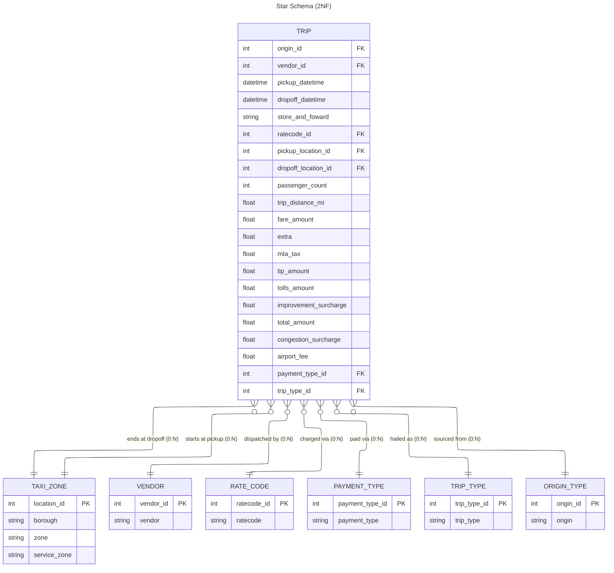

# 🚀 The 360-Degree Serverless Data Lake

Welcome to the central repository for our Next-Generation Data Platform!

This architecture represents a paradigm shift in how we ingest, process, and consume big data (specifically our massive NYC Taxi datasets). By completely decoupling storage from compute and relying on event-driven, serverless orchestration, we have achieved a platform that scales infinitely, costs nothing when idle, and provides absolute transparency to the business.

## 🌟 Executive Summary: Why This Architecture is Awesome

Most data lakes turn into expensive, unmanageable "data swamps" within a year. We engineered this platform to prevent that from day one. Here is the business and technical value we are unlocking:

* **💰 FinOps Native (Zero-Cost Idle):** We don't pay for compute we aren't using. By implementing a "Lazy Compaction" strategy and utilizing Amazon S3 Intelligent-Tiering, our storage and compute costs dynamically scale down when data isn't being actively queried.
* **🔍 The "Glass" Pipeline:** Trust in data is everything. With OpenLineage and Amazon DataZone, we have a fully transparent data dictionary. A business user looking at a dashboard can trace a metric's lineage all the way back to the raw CSV file that landed via SFTP.
* **🤝 Analyst Empowerment:** We removed the PySpark bottleneck. By utilizing Amazon Athena and dbt, our BI analysts and data scientists can build robust, version-controlled data pipelines using the SQL they already know.
* **🛡️ Frictionless & Secure Partner Onboarding:** External partners and legacy systems don't need to learn AWS IAM or use complex APIs. We offer a simple, highly secure SFTP endpoint (via AWS Transfer Family) that seamlessly bridges into our modern micro-batching pipeline.
* **🦾 Unbreakable Resilience:** One bad file shouldn't crash the company's reporting. Our Step Functions workflows isolate errors, route bad data to Dead-Letter Queues (DLQs), and immediately alert the team via Amazon SES, while allowing the rest of the healthy data to process uninterrupted.

## 🗺️ High-Level Architecture Flow

Our platform strictly adheres to the Medallion Data Architecture (Bronze, Silver, Gold/Spec), processed asynchronously to maximize efficiency.

### 1. 🥉 Bronze Layer: Secure Landing & Micro-Batching
* **Ingestion:** Actors upload data via a secure SFTP gateway.
* **Orchestration:** Data lands in `s3://sor-landing`, triggering an event queue. EventBridge Pipes micro-batches these events (every 5 mins or 256KB) and triggers our ingestion pipeline.
* **Outcome:** AWS Glue cleans the data and writes it as partitioned Parquet to the Silver layer, updating our DataZone catalog via OpenLineage. Raw data is auto-deleted after 30 days to save costs.

### 2. 🥈 Silver Layer: Lazy Compaction & Smart Storage
* **The Problem:** Micro-batching creates thousands of tiny, inefficient files.
* **The Fix:** We wait. Once every 24 hours, a CloudWatch Alarm wakes up a Step Functions state machine. It groups the small files by partition and runs parallel, tightly scoped AWS Glue jobs to compact them into highly optimized Parquet blocks.
* **Outcome:** Blazing fast Athena queries and perfect compatibility with S3 Intelligent-Tiering for automated storage cost reductions.

### 3. 🥇 Gold / Spec Layer: Business Logic & Serving
* **Transformation:** Analysts use dbt to write SQL models against the Silver layer via Amazon Athena.
* **Serving:** The aggregated, business-ready data is written to `s3://spec-layer` and instantly cataloged by AWS Glue Crawlers.
* **Outcome:** Business users consume certified, governed datasets through Amazon DataZone or their BI tool of choice.

## 🛠️ The Tech Stack

* **Ingestion:** AWS Transfer Family (SFTP), Amazon S3
* **Event Routing:** Amazon SQS, EventBridge Pipes, CloudWatch Alarms
* **Orchestration:** AWS Step Functions
* **Compute / ETL:** AWS Glue (PySpark), AWS Lambda
* **Analytics / Querying:** Amazon Athena, dbt (Data Build Tool)
* **Governance:** Amazon DataZone, OpenLineage, AWS Glue Data Catalog
* **Alerting:** Amazon SES (Simple Email Service)

## 📚 Architectural Decision Records (ADRs)

For deep technical context on why we chose specific patterns (and the alternatives we rejected), please review our ADRs in the `/docs/architecture` folder:

* `ADR-001: Secure Ingestion and Event-Driven Micro-Batching`
* `ADR-002: Lazy Compaction and Resilient Error Handling`
* `ADR-003: Storage Tiering, Lifecycle Management, and Queue Retention`
* `ADR-004: Analytical Processing (Gold Layer) and Data Discovery`

## 🚀 Getting Started

*(Note: Infrastructure-as-Code deployment instructions via Terraform/AWS CDK will be added here once the CI/CD pipelines are finalized).*

1. **Request Access:** Request an SFTP endpoint key or Athena query permissions via our internal IT portal.
2. **Explore the Data:** Log into the Amazon DataZone Portal to view the data dictionary, explore lineage, and request subscription access to specific datasets.
3. **Contribute to Models:** Clone the `/dbt-models` directory to start contributing to the Gold layer aggregations.

*Built with passion, operational rigor, and an obsession with FinOps by the Data Platform Team.*

--- 

# Purpose
Joking aside, this repository was created over practically two weekends with a lot of hard work and a little help from AI for documentation, my weak point. The architectural designs, code, and technical decisions are my own work, so feel free to use them as you wish. And I'm so sorry for not had time to put some automated tests, consider Pandera as a validation per si. If you have doubts about any decision, feel free to ask or open a issue.

Bellow I will clarify what is the output, then we will see how to run that.

## ER Diagram of TLC
This is the Entity Relationship of the result of the pipeline in second normal form (2NF) because we don't have enough data to normalize Taxi Zone from taxi_zone_lookup.csv. Those names are our canonical names, you can find _snake_case_ names, cannical mapping and descriptions at `tlc_schema.py`. Almost all the code have docstrings.




## Prerequisites

- Docker installed and running.
- Bash-compatible shell on Windows (Git Bash or WSL recommended).
- `git` (required if you plan to run `run-marquez.sh`).
- Repository root set to the current working directory.

## Setup

`start-spark.sh` uses the file `requirements-spark.txt` (from the repository root) and copies it into the container as `/tmp/requirements.txt` before installing.

## Run the ETL pipeline

To start the container and run the ETL job:

```bash
bash start-spark.sh
```

Notes on behavior:
- `start-spark.sh` will create a detached Docker container named `spark-runner`, copy `requirements-spark.txt` into the container, install packages, and then call `submit-spark.sh` to submit the job.
- If a `spark-runner` container already exists (running or stopped), `start-spark.sh` will stop and remove it and then exit. Re-run `bash start-spark.sh` to create a fresh container and start the job.
- `submit-spark.sh` runs Spark with OpenLineage settings and submits `/app/app.py` inside the container (the repository `src` directory is mounted at `/app`).

To resubmit the job when the container is already running:

```bash
bash submit-spark.sh
```

To recreate the container manually and start again:

```bash
docker stop spark-runner && docker rm spark-runner
bash start-spark.sh
```

### Run the Analysis Notebook

`analysis/main.ipynb` is provided for interactive analysis.

Options to run the notebook:

- Run Jupyter locally after installing dependencies from `requirements.txt` and open `analysis/main.ipynb` in VS Code or Jupyter locally.

## Output

The Spark job writes output to `/app/output/silver` inside the Docker container. This is mapped to `./src/output/silver`

## Optional: Run Marquez metadata tracking

To start Marquez for OpenLineage metadata ingestion:

```bash
bash run-marquez.sh
```

`run-marquez.sh` clones the Marquez repository into `.marquez` and runs its Docker-based startup scripts. This requires `git` and Docker available on the host.

The PySpark pipeline is configured to send lineage events to `http://host.docker.internal:5000` by default. On some Linux hosts `host.docker.internal` may not resolve — in that case either use the host IP address directly, or expose and map Marquez ports and update `submit-spark.sh`'s `spark.openlineage.transport.url` accordingly.

## Notes

- Input data is expected under `data/green` and `data/yellow`. The pipeline selects files matching the pattern `*_tripdata_2023*.parquet` (see `src/app.py`).
- The application entrypoint is `src/app.py` (mounted to `/app/app.py` in the container by `start-spark.sh`).
- `submit-spark.sh` submits the Spark application with OpenLineage support enabled and points to the configured lineage endpoint.

